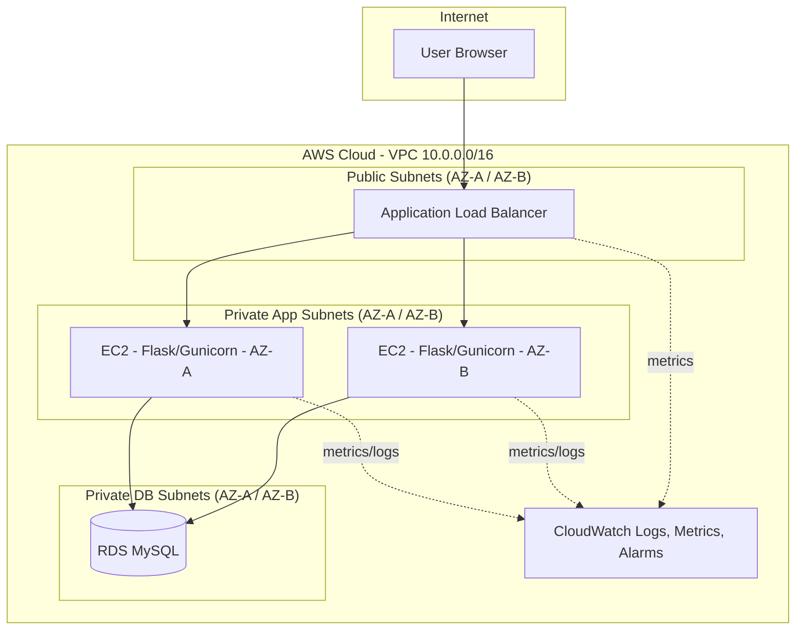
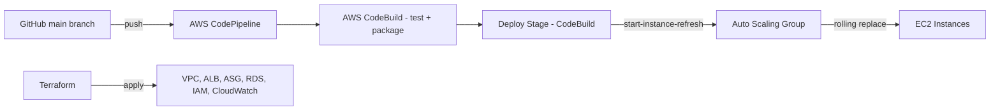

# Highly Available Three-Tier Web Application with Automated CI/CD and Infrastructure as Code on AWS

A production-style **DevOps Dashboard** web application that demonstrates a complete, real-world DevOps lifecycle on AWS: Infrastructure as Code, immutable infrastructure, automated CI/CD, high availability, auto scaling, and monitoring.

---

## 1. Problem Statement

Traditional college projects show a single web app on a single server — no resilience, no automation, no real DevOps practice. This project instead builds what a real engineering team would ship: a **three-tier, multi-AZ, auto-scaled web application** deployed entirely through **Terraform**, with code changes automatically tested, built, and rolled out through **AWS CodePipeline/CodeBuild**, monitored by **CloudWatch**.

## 2. Objectives

- Demonstrate the full DevOps lifecycle: code → build → test → deploy → monitor
- Implement Infrastructure as Code with Terraform
- Achieve high availability across two Availability Zones
- Implement immutable infrastructure (no manual server changes, ever)
- Automate CI/CD from a GitHub push to a live rolling deployment
- Apply the AWS Well-Architected Framework
- Keep the whole stack demonstrable and low-cost for a student budget

---

## 3. Architecture





### Three-Tier Design

| Tier | Component | Location |
|------|-----------|----------|
| Tier 1 — Presentation | Application Load Balancer | Public subnets |
| Tier 2 — Application | Flask REST API on EC2, in an Auto Scaling Group | Private app subnets |
| Tier 3 — Database | RDS MySQL | Private database subnets (never public) |

Traffic flow: **Internet → ALB → EC2 (ASG) → RDS**. RDS only accepts connections from the app tier's security group; EC2 only accepts traffic from the ALB's security group; only the ALB accepts traffic from the internet.

---

## 4. Technology Stack

- **Frontend:** HTML, CSS, JavaScript (responsive dashboard, polls the REST API every 10s)
- **Backend:** Python, Flask, Gunicorn, REST API
- **Database:** MySQL on AWS RDS
- **IaC:** Terraform
- **CI/CD:** AWS CodePipeline + AWS CodeBuild
- **Compute:** EC2, Auto Scaling Group, Launch Template
- **Load Balancing:** Application Load Balancer
- **Networking:** VPC, public/private subnets, IGW, NAT Gateway
- **Monitoring:** CloudWatch Logs, Metrics, Alarms, SNS
- **Security:** IAM roles, Security Groups, SSM Parameter Store (SecureString)
- **Source control:** Git + GitHub

---

## 5. Repository Structure

```
devops-dashboard/
├── app/                        # Flask application (Tier 2)
│   ├── app.py
│   ├── requirements.txt
│   ├── Dockerfile
│   ├── gunicorn.conf.py
│   ├── config/config.py
│   ├── routes/{health,status,database}.py
│   ├── services/database.py
│   ├── templates/index.html
│   ├── static/{css,js}/
│   └── tests/{test_health,test_api}.py
├── terraform/                  # Infrastructure as Code
│   ├── providers.tf / variables.tf / main.tf / outputs.tf
│   ├── vpc.tf / security_groups.tf / alb.tf
│   ├── launch_template.tf / asg.tf / rds.tf
│   ├── iam.tf / s3.tf / cloudwatch.tf
│   ├── codebuild.tf / codebuild_deploy.tf / codepipeline.tf
│   ├── user_data.sh
│   └── terraform.tfvars.example
├── buildspec.yml                # CodeBuild instructions
├── .gitignore
├── README.md
├── PRESENTATION.md
└── VIVA.md
```

---

## 6. How to Deploy

### 6.1 Prerequisites

- AWS account with an IAM user/role that has sufficient permissions (EC2, VPC, RDS, IAM, S3, CodeBuild, CodePipeline, CloudWatch, SSM)
- Terraform >= 1.5 installed
- AWS CLI v2 installed and configured (`aws configure`)
- A GitHub repository containing this project, pushed to `main`

### 6.2 One-time: connect GitHub to AWS CodePipeline

CodePipeline needs a **CodeStar Connection** to your GitHub account. This single step requires a human to click "Authorize" in a browser, so it can't be done by Terraform alone:

```bash
aws codestar-connections create-connection \
  --provider-type GitHub \
  --connection-name devops-dashboard-connection
```

Open the AWS Console → Developer Tools → Settings → Connections, find the new connection, click **Update pending connection**, and authorize it against your GitHub account/repo. Copy the resulting connection ARN.

### 6.3 Configure variables

```bash
cd terraform
cp terraform.tfvars.example terraform.tfvars
# Edit terraform.tfvars:
#   - github_owner, github_repo_name, github_repo_url
#   - codestar_connection_arn (from step 6.2)
#   - alarm_email (optional)
```

### 6.4 Deploy the infrastructure

```bash
terraform init
terraform validate
terraform plan
terraform apply
```

Type `yes` when prompted. This typically takes 8–12 minutes (RDS is the slowest resource).

### 6.5 Verify the deployment

```bash
terraform output alb_dns_name
curl $(terraform output -raw alb_dns_name)/health
```

Open the ALB URL in a browser to see the live dashboard.

### 6.6 Local application testing (before/without AWS)

```bash
cd app
pip install -r requirements.txt
pytest tests/ -v
python app.py
# visit http://localhost:5000
```

Or with Docker:

```bash
cd app
docker build -t devops-dashboard .
docker run -p 8080:8080 devops-dashboard
```

### 6.7 CI/CD setup

Once `terraform apply` finishes, `aws_codepipeline.app_pipeline` already exists and is subscribed to your GitHub `main` branch via the CodeStar connection. Any push to `main` automatically triggers: **Source → Build/Test → Deploy (rolling instance refresh)**.

```bash
git checkout -b feature/dashboard
# make changes
git add .
git commit -m "Add dashboard improvement"
git push origin feature/dashboard
# open a Pull Request on GitHub, review, merge into main
# CodePipeline starts automatically
```

---

## 7. Git Workflow

```
main
 ├── develop
 │    ├── feature/login
 │    ├── feature/dashboard
 │    └── feature/api
```

1. `git checkout -b feature/dashboard`
2. Make changes
3. `git add . && git commit -m "Add dashboard"`
4. `git push origin feature/dashboard`
5. Open a Pull Request into `main`
6. Review and merge
7. CodePipeline triggers automatically and rolls the change out to the ASG

---

## 8. High Availability & Fault Tolerance

- Minimum 2 / desired 2 / maximum 4 EC2 instances, spread across **two Availability Zones**
- ALB health checks hit `GET /health` every 15s; 2 consecutive failures mark an instance unhealthy
- The Auto Scaling Group automatically terminates unhealthy instances and launches replacements
- Because there are always ≥2 instances behind the ALB, traffic keeps flowing through the healthy instance while a replacement boots

**Zero-downtime concept:** the architecture is designed for highly available, rolling deployments with minimal/no user-visible interruption under normal operating conditions — not a mathematically guaranteed zero-downtime SLA.

## 9. Auto Scaling

Target-tracking scaling policy on **average ASG CPU utilization**, target = 60% (configurable via `asg_target_cpu_utilization`). When average CPU rises, the ASG launches more instances (up to max 4); when it falls, it scales back in (down to min 2).

## 10. Immutable Infrastructure

```
App code → CodeBuild test/package → Deploy stage triggers ASG Instance Refresh
  → Launch Template boots a fresh EC2 → user_data.sh clones latest `main` and
  configures the app automatically → old instances are drained and terminated
```

No one ever SSHes into a running instance to patch it. Every deployment is a **new instance**, built the same repeatable way from `user_data.sh`. Updating `app_version`, the AMI, or the launch template in Terraform creates a new Launch Template **version**, and the ASG performs a rolling replacement (`instance_refresh` block in `asg.tf`).

## 11. CI/CD Pipeline

```
GitHub (push to main)
   → AWS CodePipeline (Source stage, CodeStar Connection)
      → AWS CodeBuild (Build stage: pip install, pytest, package artifact)
         → CodeBuild (Deploy stage: aws autoscaling start-instance-refresh)
            → EC2 / ASG rolling deployment
```

`buildspec.yml` defines: `install` → `pre_build` (tests) → `build` (validate + zip artifact) → `post_build`.

## 12. Monitoring

CloudWatch tracks:
- EC2 CPU utilization → `high-cpu` alarm (> 70%)
- ALB unhealthy host count → `unhealthy-hosts` alarm
- ALB 5xx error count → `alb-5xx` alarm
- ALB target response time → `high-latency` alarm
- Application + bootstrap logs → `/devops-dashboard/app` and `/devops-dashboard/user-data` log groups

All alarms publish to an SNS topic; subscribe an email via `alarm_email` in `terraform.tfvars`. These alarms give early warning of the exact failure conditions the Well-Architected Reliability pillar cares about — before they become an outage.

## 13. Security

- RDS has **no public IP** and only accepts traffic from the app security group
- EC2 only accepts app-port traffic from the ALB security group
- Only the ALB accepts inbound traffic from the internet, and only on port 80
- No hardcoded credentials anywhere — DB password is auto-generated by Terraform (`random_password`) and stored as a `SecureString` in SSM Parameter Store; EC2 reads it via its IAM instance profile at boot
- EC2 uses **IMDSv2** (`http_tokens = "required"`) and SSM Session Manager instead of SSH keys
- CodeBuild and CodePipeline each use a dedicated least-privilege IAM service role

## 14. AWS Well-Architected Framework Mapping

| Pillar | What we implement | AWS Service | Why it helps |
|---|---|---|---|
| **Operational Excellence** | IaC, CI/CD, automated tests, centralized logs | Terraform, CodePipeline, CodeBuild, CloudWatch Logs | Every change is versioned, tested, and repeatable; failures are diagnosable from logs, not guesswork |
| **Security** | Private subnets, least-privilege SGs/IAM, no hardcoded secrets | VPC, Security Groups, IAM, SSM Parameter Store | Shrinks the attack surface and removes credential leakage risk |
| **Reliability** | Multi-AZ EC2, ALB health checks, Auto Scaling replacement, automated backups | ALB, ASG, RDS automated backups | Tolerates a single instance or AZ-level app failure without downtime |
| **Performance Efficiency** | Right-sized `t3.micro`/`db.t3.micro`, target-tracking scaling | EC2, RDS, ASG | Capacity matches real-time demand instead of static over-provisioning |
| **Cost Optimization** | Free-tier-eligible instance sizes, min ASG=2, optional NAT, `terraform destroy` cleanup | EC2, RDS, NAT Gateway | Keeps a always-on demo affordable for a student budget |
| **Sustainability** | Auto Scaling scales in when idle; no over-provisioned always-on fleet | Auto Scaling Group | Uses only the compute actually needed at any given time |

---

## 15. AWS CLI Reference

```bash
# Confirm which AWS identity/role you're using
aws sts get-caller-identity

# List running EC2 instances (the app tier)
aws ec2 describe-instances --filters "Name=tag:Project,Values=devops-dashboard" \
  --query "Reservations[].Instances[].[InstanceId,State.Name,PrivateIpAddress]" --output table

# Inspect the Auto Scaling Group (shows min/desired/max and instance count)
aws autoscaling describe-auto-scaling-groups \
  --auto-scaling-group-names devops-dashboard-production-asg

# Check ALB target health (which instances are healthy/unhealthy)
aws elbv2 describe-target-health --target-group-arn <target_group_arn>

# Inspect the RDS instance (confirm Multi-AZ, engine, status)
aws rds describe-db-instances --db-instance-identifier devops-dashboard-production-db

# List active CloudWatch alarms and their state
aws cloudwatch describe-alarms --alarm-name-prefix devops-dashboard

# List CloudWatch log groups created by this project
aws logs describe-log-groups --log-group-name-prefix /devops-dashboard

# Watch a CodePipeline execution live
aws codepipeline get-pipeline-state --name devops-dashboard-production-pipeline

# Manually trigger a rolling instance refresh (used in the demo)
aws autoscaling start-instance-refresh --auto-scaling-group-name <asg_name>
```

Each command demonstrates a different observability angle: `sts` confirms *who* is deploying, `describe-instances`/`describe-auto-scaling-groups` confirm *what compute exists*, `describe-target-health` confirms *is it actually serving traffic*, `describe-db-instances` confirms *is the data tier healthy*, and the `cloudwatch`/`logs` commands confirm *is anything alarming or logged*.

---

## 16. Failure / High-Availability Demonstration

1. Open the ALB URL — dashboard loads, shows `HEALTHY`
2. Show two EC2 instances running in the console (`aws ec2 describe-instances`)
3. Show the ALB target group with 2 healthy targets
4. Show the RDS instance (private, `Available` status)
5. Push a small code change to GitHub `main`
6. Show CodePipeline auto-starting (`aws codepipeline get-pipeline-state`)
7. Show CodeBuild running tests and packaging the artifact
8. Show the deploy stage triggering an instance refresh
9. Refresh the dashboard — new `LAST_DEPLOYED_AT` timestamp appears
10. **Terminate one EC2 instance manually**: `aws ec2 terminate-instances --instance-ids <id>`
11. Show the ALB marking that target unhealthy within ~30s
12. Show the ASG launching a replacement instance automatically
13. Refresh the website throughout — it keeps responding via the remaining healthy instance
14. Once the replacement passes health checks, show the target group back to 2/2 healthy

---

## 17. Troubleshooting

| Symptom | Likely cause | Fix |
|---|---|---|
| ALB returns 502/504 | App not yet booted, or `/health` failing | Check `/var/log/user-data.log` on the instance via SSM Session Manager |
| Instances keep cycling (never healthy) | user_data.sh failed (bad GitHub URL, pip failure) | `aws ssm start-session --target <instance-id>`, review `user-data.log` |
| DB connection errors | SG rule missing, or SSM parameters not yet created | Confirm `aws ssm get-parameter --name /devops-dashboard/db_host` |
| CodePipeline stuck at Source | CodeStar connection not authorized | Re-authorize in Console → Developer Tools → Connections |
| `terraform apply` fails on RDS | Instance class not available in region/AZ | Try a different `db_instance_class` or region |

## 18. Cost Optimization & Cleanup

Resources that generate ongoing charges: EC2 instances (2–4x t3.micro), RDS (db.t3.micro), NAT Gateway (hourly + data), ALB (hourly), CloudWatch (minor). Free-tier eligible accounts substantially offset EC2/RDS cost for the first 12 months.

**When your demonstration is complete, always destroy the stack:**

```bash
cd terraform
terraform destroy
```

Type `yes` to confirm. This removes every billable resource created by this project.

---

## 19. Presentation Talking Points

See [`PRESENTATION.md`](./PRESENTATION.md) for a full slide-by-slide script, and [`VIVA.md`](./VIVA.md) for 30+ anticipated questions and answers.
